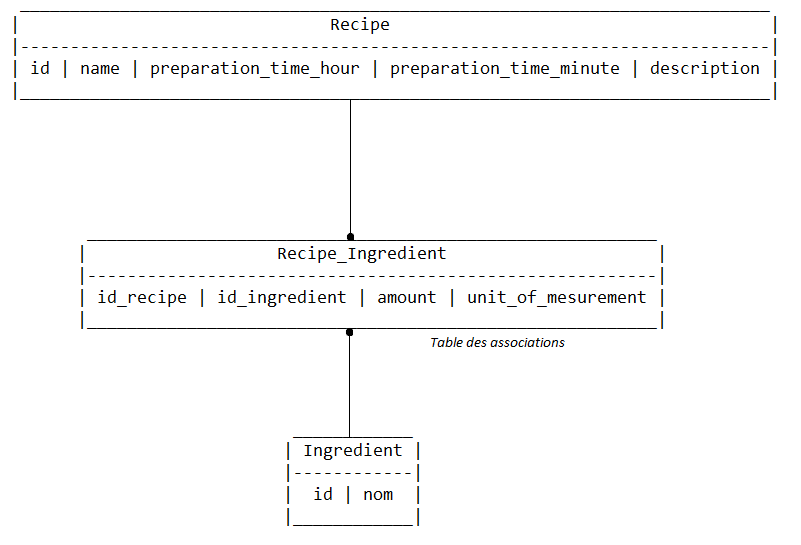

# Introduction

Le principe est de créer une API rest simple start-from-scratch en Java 17 avec un CRUD, une base de données, Maven, SpringBoot, Spring JPA et Hibernate, SpringSecurity, et de conteneuriser cette API. L'objectif aussi et de mettre en place une connexion/authentification.

# Base de données MariaDB
Le choix de la base de donnée a été fait stratégiquement pour correspondre au mieux aux besoins ainsi qu'à
la tendance actuelle. MariaDB à l'avantage d'être multiplateformes, facile à utiliser, open-source et régulièrement mis à jour. Il a cependant des difficultés avec les gros volumes de données mais pour cet exercice cela ne pose pas problème.
Les systèmes de gestion de base de données MySQL et MariaDB reposent sur le même noyau logiciel. MariaDB est un fork de MySQL 5.1, mais a évolué au fil du temps pour devenir un système de gestion de base de données autonome.
En complément des moteurs standard pris en charge par MySQL, les utilisateurs disposent d’un nombre croissant de moteurs de base de données alternatifs pour des cas d’utilisation spécifiques. MariaDB propose non seulement un large choix de moteurs de base de données alternatifs, mais offre également un optimiseur de requêtes SQL efficace.
Convient aux scénarios de bases de données distribuées. MariaDB offre des fonctions de cryptage assez sophistiquées.

## Installation
MariaDB a été installée en local puis ont été effectuées les requêtes suivantes :

    CREATE DATABASE apidatabase;
    USE DATABASE;

Aucune migration ne peut être faite sans que la base n'existe déjà au préalable donc ces requêtes sont obligatoires. À partir de là, il est possible d'utiliser DBeaver pour se connecter à la base de données, cependant vide de tables. Ensuite, flyway a été configuré comme dépendance dans le pom.xml :

    <dependency>
    <groupId>org.flywaydb</groupId>
    <artifactId>flyway-mysql</artifactId>
    <version>9.11.0</version>
    </dependency>

ainsi que dans l'application-local.properties :

    ## Flyway : migrations framework for database deployments
    flyway.url=jdbc:mariadb://localhost:3306/**database_name_used_in_request**
    flyway.user=**database_USER_set_when_installing_mariaDB**
    flyway.password=**database_PWD_set_when_installing_mariaDB**
    flyway.locations=classpath:db/migration
    spring.flyway.baselineOnMigrate = true
    flyway.baselineVersion=1
    
    spring.datasource.url=${flyway.url}
    spring.datasource.username=${flyway.user}
    spring.datasource.password=${flyway.password}
    spring.datasource.driver-class-name=org.mariadb.jdbc.Driver

et la commande maven suivante a été lancée :

    clean install -Dspring.profiles.active=local -Dflyway.configFiles=src/main/resources/application-local.properties flyway:migrate

les deux options permettant de demander la prise en compte de l'application-local.properties par Maven et flyway.

Flyway permet de gérer les migrations, cette commande lancée à donc mis à jour la base de donnée qui est maintenant remplies des tables dont les lignes de requêtes ont été écrites dans des fichiers SQL utilisés par Flyway à cet effet.
Elles sont visibles sur DBeaver maintenant. Pour utiliser correctement les fonctionnalités de flyway, certaines conventions doivent être respectées:
https://blog.webnersolutions.com/java-execute-sql-script-using-maven/
L'utilisation de Flyway implique que la migration de la base de données se fait via Flyway et non pas via l'ORM donc il faut désactiver la migration par hibernate dans l'application.properties:

    spring.jpa.hibernate.ddl-auto=none

De ce fait, les options nullable, optional au niveau des @Column sur les champs des entités seront ignorés et doivent donc être précisé absolument dans le script SQL. Toutes les contraintes doivent y être apparentes.

Afin de setter l'encoding en UTF-8 des fichiers via IntelliJ : File > Settings > Editor > File Encodings > Global Encoding : UTF-8

## Modèle de données
Le mdd choisi est le suivant :

## Script sql
La table des associations doit être créée explicitement dans le .sql et une entité côté spring devra être créée pour représenter cette table de jointure. Comme il s'agit d'une relation ManyToMany entre les recettes et les ingrédients,
la table de jointure faisant office d'intermédiaire entre les deux oblige à découper cette relation en deux relations OneToMany.

# Spring, JPA, Hibernate

## Hierarchie et annotation
L'utilisation d'un objet inclus (embedded) a été nécessaire pour inclure le temps de préparation découpé en heures et en miniutes. Cependant en tant qu'objet inclu ce n'est pas une entité, il est dépendant de la classe qui l'inclus et donc n'a pas sa propre table dans le mdd.

## Run App
Pour run l'application dans le cas où l'on souhaite utiliser un autre application-env.properties plutôt que application.properties par défaut, il faut ajouté un option VM avec comme flag : 

    -Dspring.profiles.active=env

Ici, env correspond à la deuxième partie du nom du fichier après le tiret qui aura été choisi, par exemple : local.

## Contraintes objets en prévision des contraintes colonnes SQL
Plus besoin de créer des validators. Hibernate Validator possède des annotations pour faire directement la validation des beans. Il est même possible de personnaliser des annotations de validations. Il est ensuite possible d'écrire les tests associés. Les notions d'héritage et de composition sont prise en compte dans ce concept : https://jmdoudoux.developpez.com/cours/developpons/java/chap-validation_donnees.php

## HTTPS
Un self-signed certificate a été généré afin de permettre les requêtes et donc le chiffrage des données via HTTPS. Pour exécuter les commandes, il a fallu se placer dans le \bin du file system ou se situe la jdk, est d'écrire dans le terminal le chemin absolue du keytool.exe entre guillemet pour pouvoir accéder aux fonctionnalités de keytool qui est directement intégré dans la jdk.
Le format du keystore qui a été retenu est le PKCS12 qui est le format recommandé depuis la version 9 de java. Il peut contenir de multiples certificats et clés.
Pour des raison de sécurité ce certificat n'est pas fourni il faut néanmoins en générer pour pouvoir faire les requêtes vers l'API et configurer les variables du fichier application.properties : https://www.thomasvitale.com/https-spring-boot-ssl-certificate/
Une fois HTTPS configuré, avec un self-signed certificate, notre navigateur ne fera pas confiance en notre application et avertira l'utilisateur que ce n'est pas securisé. Et ça sera le cas pour tout les clients. C'est possible pousser un client à croire en l'application en lui fournissant notre certificat.
Comme le certificat est stocké dans notre keystore il faut l'en extraire pour le fournir au client. Enfin, ce certificat a également été importé dans le keystore de la JRE.
Pour lancer les requêtes via Postman, il faut désactiver a verification des certificats SSL dans les settings des requêtes. 
Does certificate common name matter? The certificate is valid only if the request hostname matches the certificate common name.

## SPRING SECURITY
### Authentification basique
Le starter-security inclue la classe SecurityAutoConfiguration qui contient la configuration de sécurité par défaut. Cela signifie que l'application Spring Boot sécurise automatiquement toutes les requêtes HTTP avec une authentification "basic".   
Pour une authentification basique (credentials envoyés à chaque requête), nous avions la classe de configuration suivante :

    @Configuration
    public class SpringSecurityConfig {

        /* Spring Security uses the Synchronizer Token pattern to generate a CSRF token that
        protects against CSRF attacks. When an HTTP request is submitted, Spring Security will
        compare the expected CSRF token with the one sent in the HTTP request. The request will
        be processed only if the token values match else the request will be treated as a forged
        request and be rejected with status 403 (Forbidden). On a accepté les requêtes avec une
        un Http Basic Authentication et via le formulaire par défaut de spring security*/
    
        @Bean
        public SecurityFilterChain filterChain(HttpSecurity http) throws Exception {
            http
                    .csrf().disable()
                    .authorizeHttpRequests()
                    .requestMatchers(HttpMethod.POST, "/api/recette").authenticated()
                    .anyRequest().permitAll()
                    .and()
                    .formLogin()
                    .and()
                    .httpBasic().realmName("REALM");
            return http.build();
        }
    
        @Bean
        public AuthenticationManager authManager(HttpSecurity http) throws Exception {
            return http.getSharedObject(AuthenticationManagerBuilder.class)
                    .userDetailsService(userDetailsService())
                    .passwordEncoder(encoder())
                    .and()
                    .authenticationProvider(authProvider())
                    .build();
        }
    
        @Bean
        public DaoAuthenticationProvider authProvider() {
            final DaoAuthenticationProvider authProvider = new DaoAuthenticationProvider();
            authProvider.setUserDetailsService(userDetailsService());
            authProvider.setPasswordEncoder(encoder());
            return authProvider;
        }
    
        @Bean
        public PasswordEncoder encoder() {
            return new Argon2PasswordEncoder(SALT_LENGTH, HASH_LENGTH, ARGON2_PARALLELISM, ARGON2_MEMORY, ARGON2_ITERATIONS);
        }
    
        @Bean
        public UserDetailsService userDetailsService(){
            return new UserService();
        }
    }

### Authentification via JWT
A simple solution to avoid circular dependencies is to separate the definition of the bean from the injection of the bean that depends on it in different classes so that Spring will handle generating them in the right order itself. https://stackoverflow.com/questions/40695893/spring-security-circular-bean-dependency